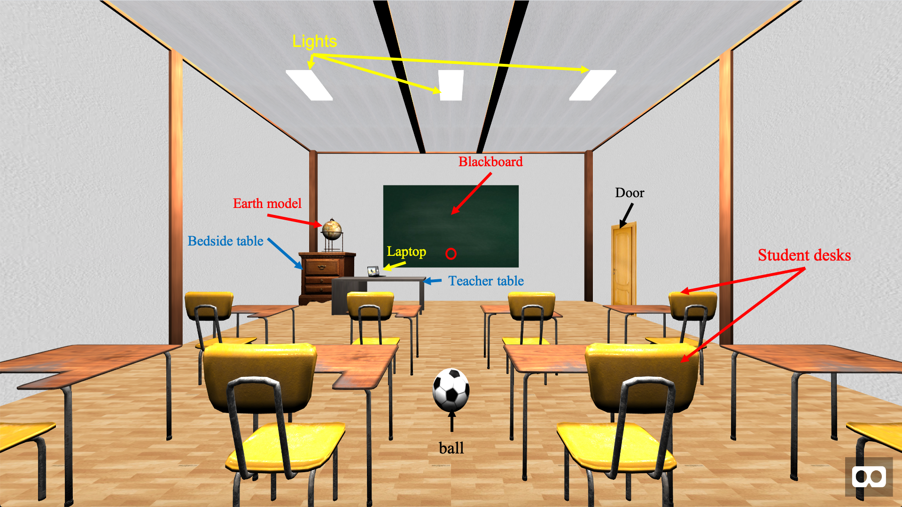
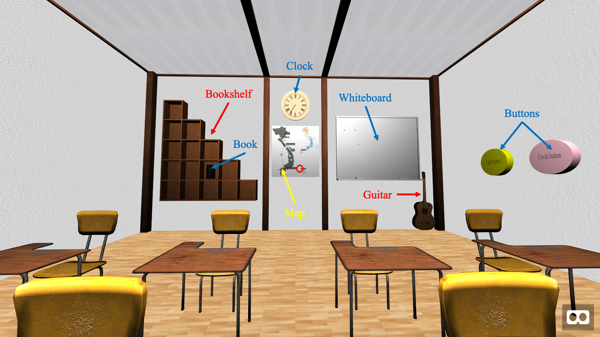
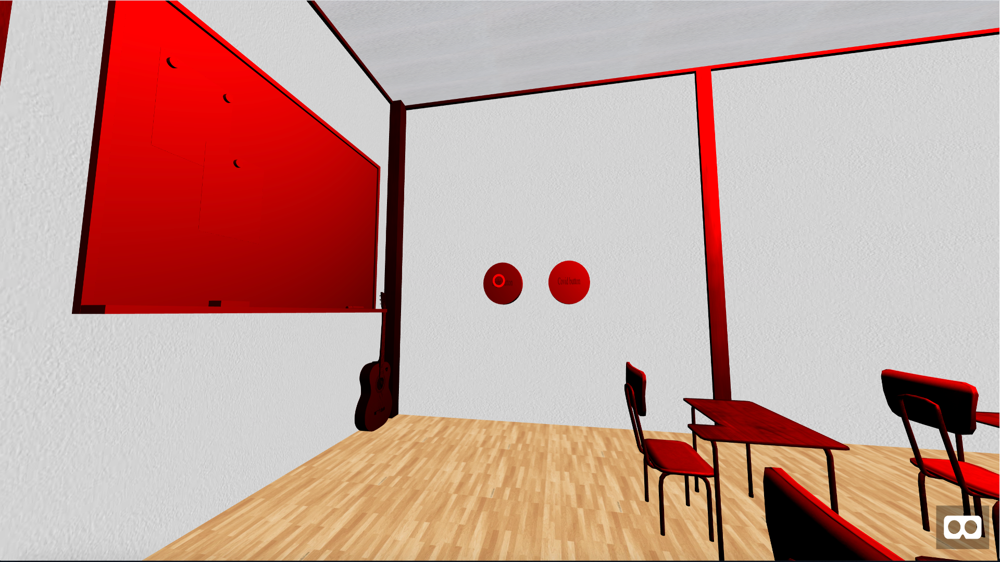
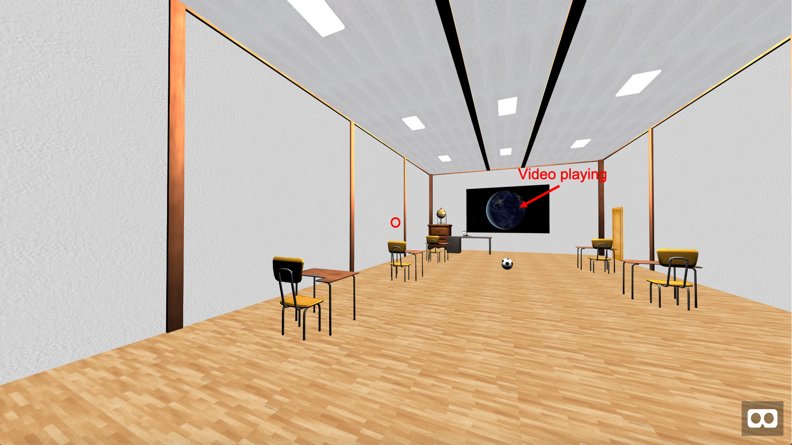

# VR-project1
Student name: Bao Dien Quoc Nguyen
R#: 11660127

## Video
This is the [link](https://1drv.ms/v/s!AjX6su0tphMGeKzF5wfig7PH3B8?e=rXynu0) of the video

## Demo
This is the [link](https://baodnguyen.github.io/VR-project1/) of the demo

## Description of the VR classroom
The front of the class:

The back of the class:

Models that I get from the internet:
1. Whiteboard
2. Teacher desks
3. Bedside table
4. Earth model
5. Student desks
6. Book shelf
7. Book
8. Guitar
9. Laptop

Models that I build:
1. Blackboard
2. Lights
3. Door
4. Ball
5. Clock
6. Map
7. Buttons
8. Floor
9. Walls
10. Ceil

Lights can change color by clicking the 'Light button':

Covid button turn the classroom to the time of Covid. We practice social distance and online teaching.

Other features (see video or demo):

Dynamic objects: the ball, the clock.

Interaction with objects: click the guitar to play a music. 

## Reference
The 3D models from the internet:

Whiteboard:
https://sketchfab.com/3d-models/whiteboard-low-poly-1a6c9cd6166f46f998faf3a2b01031fa

Teacher desks:
https://sketchfab.com/3d-models/desk-d63842d0dba54ec2be00b0d9ee60c103#download

Bedside table:
https://sketchfab.com/3d-models/bedside-table-2cdb30045bf84c3a82c4defe2bbcc516

Earth model:
https://sketchfab.com/3d-models/earth-mini-bar-fbfe5855b91c49899cf446f52a7b88a0

Student desks:
https://sketchfab.com/3d-models/student-desk-99df535ae9b848708f08a88121b9120b

Book shelf:
https://sketchfab.com/3d-models/book-shelf-eb8efa96966b481d8fd254e2c1379cee

Book:
https://sketchfab.com/3d-models/old-book-84145cf4a3984ff59867f8abfe9138ad

Guitar:
https://sketchfab.com/3d-models/classic-guitar-f1c018c806044337802f08b3809a82a6

Laptop:
https://sketchfab.com/3d-models/laptop-dc3daa4c867a4582b6aaeeb484ca7bf4